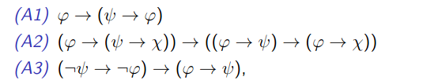
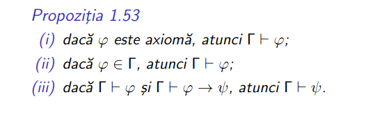
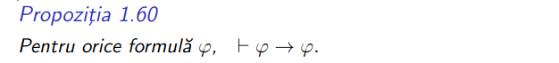
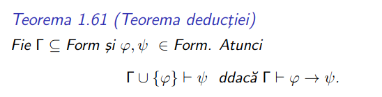
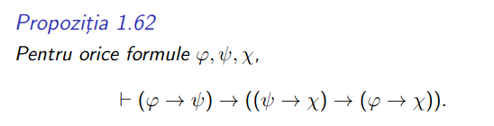
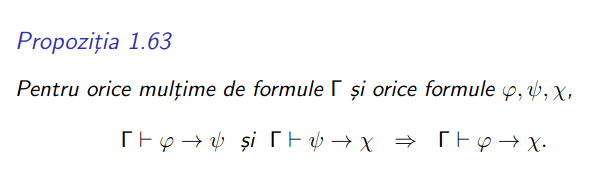
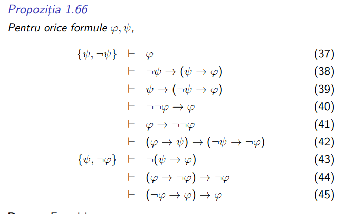
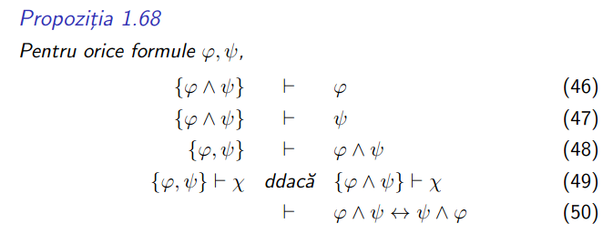

## Table of contents

- [Table of contents](#table-of-contents)
- [Cheat sheet for theorem proofs](#cheat-sheet-for-theorem-proofs)
  - [Exercises (from here)](#exercises-from-here)

## Cheat sheet for theorem proofs

> **IMPORTANT**: [Resource with all proofs from the course](https://github.com/anamariapanait10/FMI-BS-Resources/tree/master/Year%20I/sem%201/Logica%20matematica%20si%20computationala/seminar)

### Exercises (from [here](https://github.com/anamariapanait10/FMI-BS-Resources/tree/master/Year%20I/sem%201/Logica%20matematica%20si%20computationala/seminar))
- Seminar 5, ex 1 b
- Seminar 5, ex 2
- Seminar 9, ex 4
- Seminar 9, ex 7
- [Examen](https://github.com/anamariapanait10/FMI-BS-Resources/blob/master/Year%20I/sem%201/Logica%20matematica%20si%20computationala/examen/model-examen.pdf): P7, P8, P10, P11, P12, P15